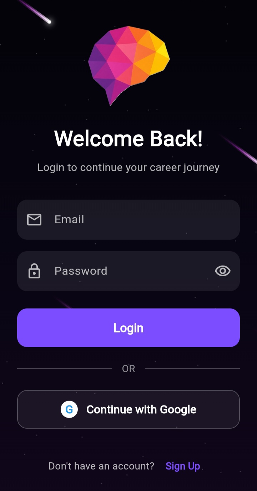
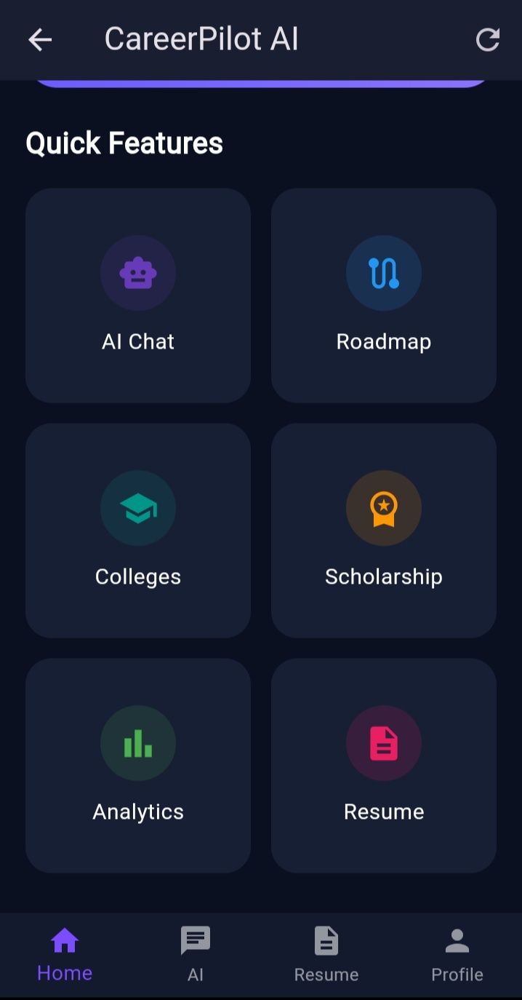
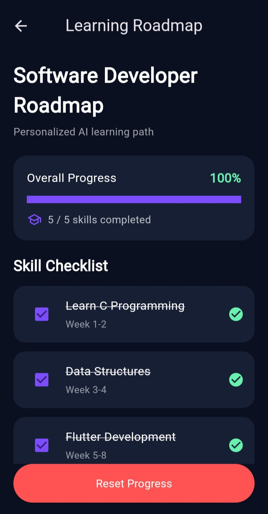
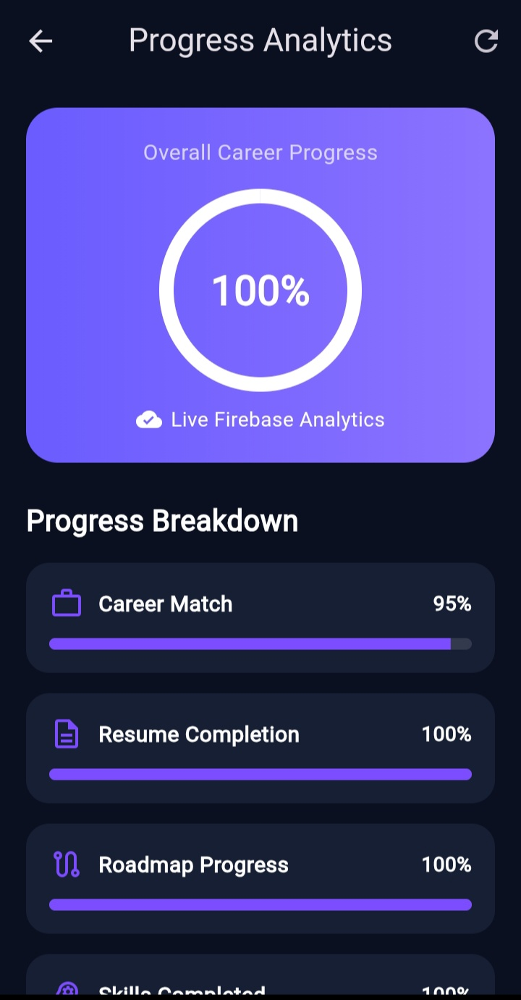
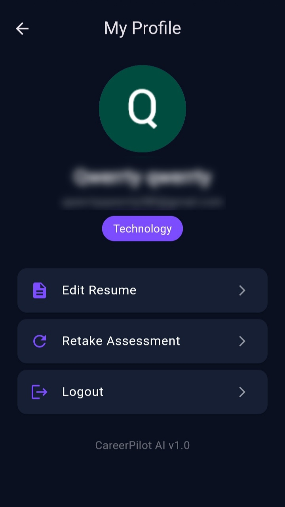

# 🚀 CareerPilot AI

> An AI-powered career guidance and planning application designed to help students discover suitable career paths, identify skill gaps, build personalized learning roadmaps, and prepare for their future careers.

---

## 📌 Project Overview

**CareerPilot AI** is a Flutter-based AI career guidance application developed to help students make better-informed career decisions.

Many students choose careers without proper guidance, which can lead to unsuitable career choices, skill gaps, poor planning, and reduced employability.

CareerPilot AI addresses this problem by providing personalized career recommendations based on a student's interests, skills, education, and career goals.

---

## 🎯 Objectives

- Help students identify suitable career options.
- Provide personalized career recommendations.
- Analyze existing skills and identify skill gaps.
- Generate personalized learning roadmaps.
- Provide AI-powered career guidance.
- Help students prepare professional resumes.
- Provide AI-based interview preparation.
- Track learning and career progress.
- Store user data securely using Firebase.

---

## ✨ Features

### 👤 User Authentication
- Email and password registration.
- Email and password login.
- Google authentication.
- Firebase Authentication.
- Separate signup and login flow.

### 🧠 AI Career Recommendation
The application analyzes:

- Interests
- Skills
- Education
- Career goals

and provides a suitable career recommendation with a career match score.

### 🗺️ Personalized Learning Roadmap
Users can follow a structured roadmap to develop the skills required for their selected career.

### 📊 Skill Gap Analysis
CareerPilot AI helps users understand the skills they already have and the skills they need to develop.

### 💬 AI Career Chat
Users can interact with the AI to ask career-related questions and receive guidance.

### 📄 Resume Builder
Users can create and manage a professional resume inside the application.

### 📈 Progress Tracking
Users can track their:

- Career progress
- Roadmap progress
- Completed skills
- Resume completion
- AI chat activity

---

## 🛠️ Technology Stack

| Technology | Purpose |
|---|---|
| Flutter | Cross-platform application development |
| Dart | Programming language |
| Firebase Authentication | User authentication |
| Cloud Firestore | Database |
| Google Sign-In | Google authentication |
| Gemini API | AI-powered career assistance |
| PDF | Resume PDF generation |
| Printing | Resume printing/export |
| Image Picker | Image selection |
| Firebase | Backend services |

---

## 🏗️ Application Architecture

```text
                    ┌─────────────────────┐
                    │      Student        │
                    └──────────┬──────────┘
                               │
                               ▼
                    ┌─────────────────────┐
                    │   CareerPilot AI    │
                    │    Flutter App      │
                    └──────────┬──────────┘
                               │
             ┌─────────────────┼─────────────────┐
             │                 │                 │
             ▼                 ▼                 ▼
      ┌─────────────┐   ┌─────────────┐   ┌─────────────┐
      │  Firebase   │   │  Gemini AI  │   │   Resume    │
      │    Auth     │   │    API      │   │   Builder   │
      └─────────────┘   └─────────────┘   └─────────────┘
             │                 │                 │
             └─────────────────┼─────────────────┘
                               ▼
                    ┌─────────────────────┐
                    │   Personalized      │
                    │ Career Guidance     │
                    └─────────────────────┘
```

---

## 📸 Application Screenshots

### 🔐 Login Screen


### 🏠 Home Screen


### 🗺️ Roadmap Screen


### 📊 Analysis Screen


### 👤 Profile Screen


---

## 📜 Copyright & Usage

© 2026 CareerPilot AI. All rights reserved.

This project is published for academic and portfolio purposes.

The source code, design, content, and other materials in this repository may not be copied, modified, distributed, or used for commercial purposes without permission from the CareerPilot AI project team.

---

## 🚀 How to Run

### Prerequisites

Make sure the following are installed:

- Flutter SDK
- Android Studio
- Android SDK
- A connected Android device or emulator
- Firebase project configuration

### Setup

1. Clone the repository:

```bash
git clone https://github.com/Dhairya-Rupchandani/CareerPilot-AI.git
cd CareerPilot-AI

---

## 📁 Project Structure

```text
careerpilot_ai_new/
│
├── android/              # Android platform configuration
├── assets/
│   └── images/           # Application images and logo
│
├── lib/
│   ├── core/             # Core application configuration
│   ├── models/           # Data models
│   ├── screens/          # Application screens and UI
│   ├── services/         # Firebase, AI and application services
│   └── widgets/          # Reusable UI widgets
│
├── screenshots/          # Application screenshots
├── pubspec.yaml          # Flutter dependencies and configuration
├── firebase.json         # Firebase configuration
└── README.md             # Project documentation